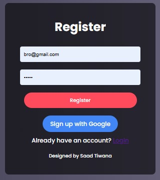

# 🚀 Whisper: The Next-Level Secrets Sharing App

> **"Some whispers should never be lost."**

Welcome to **Whisper** – the app that lets you share your deepest secrets in a way that's as secure as it is stylish. This isn’t your average secrets app; it's designed with next-level UI, smooth animations, and robust authentication (both Local and Google OAuth) to give you a seamless, immersive experience. Whether you're looking to vent, confide, or simply share a quirky thought, Whisper is here to keep your whispers safe and sound.

---

## 📸 Page Previews

Get a sneak peek at what awaits you on each page! When you upload your files, these images will show up in the repository for everyone to admire:

| **Page**              | **Preview**                   |
| --------------------- | ----------------------------- |
| **Home** 🌠          |              |
| **Login** 🔑          |            |
| **Register** 📠      |      |
| **Whispers** 🤫       |      |
| **Submit Whisper** ✍️ |          |

---

## 🛠 Features That Make Whisper Awesome

- **User Authentication**: Sign in locally or use your Google account. Your identity is safe, and your secrets are even safer!
- **User-Specific Whispers**: Only you can see your own whispers—privacy is our middle name.
- **Full-Screen, Aesthetic UI**: Enjoy a beautifully designed, immersive interface that adapts to any device.
- **Smooth Transitions & Animations**: Our app glides like butter; every click feels fluid and responsive.
- **Dark Mode Ready**: Whether you're a night owl or an early bird, Whisper supports both light and dark themes for your comfort.

---

## 🚀 Setup & Installation

Ready to dive in? Follow these simple steps to get your very own copy of Whisper up and running:

1. **Clone the Repository**

   Open your terminal and run:
   ```bash
   git clone https://github.com/saadhtiwana/whisper.git
   cd whisper
